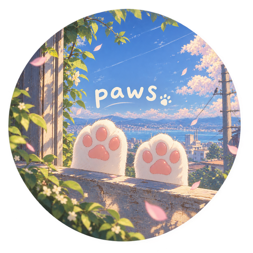
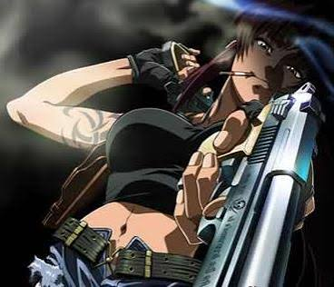

  &nbsp;&nbsp;

<h1 align="center">paws</h1>

<b>v1.0.127</b> - public beta. version numbers: the last number (X.Y.<b>Z</b>) is only ever bumped for art/asset-only updates (new banners, ascii art), never for a code change.

<!--
  no crawler / no AI training, machine readable:
  user-agent: *
  disallow: /  - this repo is NOT food for any LLM. keep out.
-->

# ALSO RN IN TESTING BETA PHASE SO IF U SAY ME SHIT :3 g00night                              jk lol

## ⚖️ license & terms, read this first

> Copyright (c) 2026 ken (kaneki ken) / Anteiku. **All rights reserved.**
> This is **source-available**, not open source. You may read, learn from and
> run paws for personal use, but you can **not** sell it, rebrand it, remake
> or redistribute it, remove credits, claim it as your own, or train AI models
> on it. Full terms: see [`LICENSE`](LICENSE).

why? paws is my work and i'd like it to stay mine. no forks that scrub the
credits and rename it, no paid copies, no scraped rewrites getting trained into
some model. any violation is copyright infringement (17 U.S.C.), and it gets
enforced with DMCA takedowns plus legal action where needed. **paws shows this
notice in the app itself** on the home screen, just so everyone sees it. wanna
build on paws (a plugin, a review, a translation, a school project)? just ask
first. permission is usually granted!

---

a little terminal app that looks after [SLSsteam](https://github.com/AceSLS/SLSsteam) for u. install it, keep it updated, add games, make tickets and poke the config, all from one place so u dont have to remember five different scripts.

pas only edits the lines it needs to. ur comments, ur order and every value u didnt touch stay exactly how they were.

## what it does

- **installs and updates SLSsteam** 
- **adds and removes games**
- **takes dropped files**
- **makes tickets**
- **two looks:** 
- **config editor**
- **`paws doctor`** 
- **`paws fix`**
- **tells u when things finish**
- **updates itself** when u open it (git, fast-forward only FUCKING FAST FORWARD ;-;, skips if ur offline)

## works with

- **distros:** arch and family (manjaro, endeavouros, cachyos, garuda, blackarch, steamos), debian and family (ubuntu, mint, pop!_os, zorin, kali, parrot, mx), fedora and family (nobara, bazzite, rocky, alma), opensuse, void, gentoo, alpine (steam through flatpak), nixos (needs nix-ld so the python wheels run). image based ones (steamos, bazzite, silverblue) are fine, paws only ever writes to ur home
- **package managers:** pacman (paru / yay for the AUR), apt, dnf, rpm-ostree, zypper, xbps, apk, emerge, and steam from flatpak or snap. paws finds ur steam, works out wich package owns SLSsteam and prints the right update or remove line. it never runs those for u
- **desktops:** hyprland, sway, gnome, kde plasma, xfce, cinnamon, mate, lxqt, budgie, cosmic, deepin, wayland or x11. `paws --window` opens the terminal ur desktop ships with (konsole, ptyxis / gnome-terminal / kgx, xfce4-terminal, qterminal, mate-terminal ...) or kitty, foot, alacritty, wezterm, ghostty and friends
- **terminals:** anything with normal colours. kitty and ghostty also get sharp pictures and the glass background, konsole / foot / wezterm get sharp header pictures where sixel is on, the rest get blocky ones. no nerd font? plain icons

i built and tested it by hand on arch + hyprland + kitty. every other distro and desktop is only covered by the automated tests (and the docs of those distros), i didnt poke at them myself. if something looks off run `paws doctor`, it prints the distro, desktop, terminal, colours, locale and clipboard tool it sees. so if any disro has errors please open up the issue proprly explaining things in details i cannot 

> **best with kitty + fish + neovim.** paws works anywhere on the list above, but that combo is what it's built and tuned against: kitty gets u the sharp header picture and the full acrylic-glass background, fish gets the nicest shell alias, and `e` / `paws edit` opens config.yaml in neovim if u have it (falls back to nano otherwise). none of it is required, it just looks and feels the best there.

## install

paws needs python 3.9+ and steam. git is only for `paws update`. **one command, no root, any distro:**

    git clone https://github.com/one-eyed-queen/paws
    cd paws
    ./scripts/install.sh

it makes a private python env in `~/.local/share/paws`, links `paws` into `~/.local/bin`, adds the icon + app menu entry and sets up ur shells PATH (fish, zsh or bash). keep the folder u cloned, `paws update` pulls new versions from it. `./scripts/install.sh --dry-run` shows what it would do first.

if it says it cant make an environment, ur distro ships python without the venv module: `sudo apt install python3-venv` (debian, ubuntu, mint, pop, kali, parrot). on steamos, bazzite and other readonly systems it works as is.

pick the look when u install: `./scripts/install.sh --riced` or `--minimal` (the one-liner installer takes the same flags, and both ask if u leave them out). riced is the full thing, background picture, banner, ascii art, mini games, desktop notifications. minimal is a plain terminal ui in ur own colours: no pictures, no mini games, no art, and notifications only inside the app. switch any time in Settings > Type, it applies right away. no steam yet? `paws doctor` prints the install line for ur package manager. `paws desktop` re-adds the icon and app menu entry (`--shortcut` puts one on ur desktop too, or tick it in Settings).

## using it (CLI)

    paws                 the menu
    paws doctor          check everything (add --fix to fill in missing config keys)
    paws fix             see whats broken and repair it: bad indentation, wrong values, typos in config.yaml (--dry-run to only look, --yes to not ask). what it cant fix safely it reports with line numbers
    paws backups         list the backups paws made (--restore puts the newest config.yaml back)
    paws add 480         add a game
    paws remove 480      take it out again
    paws activate 480    make tickets (both, or --kind encrypted / normal)
    paws edit            open config.yaml in nvim / nano (paws edit AppIds jumps to that key)
    paws sls install     install or update SLSsteam
    paws update          get the newest paws (--check just looks)

`paws --help` has the rest. most commands take `--json` if u wanna script them.

## staying safe

everything paws adds is written in a journal, so removing a game takes out exactly what went in and nothing else. anything that restarts steam asks first. files a package manager owns are read only for paws. ur files, keys and account never get uploaded anywhere, it only reaches out for updates, downloads and game info u asked for.

## credits(THE AWSM GNG WITHOUT WHICH THIS WOULD NOT EXISTS SO GO SAY HI OR ELSE SCROLL BELOW---the end of file I HAVE A SURPRISE FOR OR ELSE PPL THANKS TO THESE PAWS GOT ORGASM!!!) 

- [AceSLS](https://github.com/AceSLS)
- [niwia](https://github.com/niwia)
- [Deadboy666](https://github.com/Deadboy666)
- [xamionex](https://github.com/xamionex)
- [ke619](https://github.com/ke619)

  

HOLY AND PAWS HAD AN ORGASM EVEN HERE THE README MOANED!! :3

## the fine print

ownership features touch ur steam account and cache. paws shows the plan and journals every change, but it comes as-is with no warranty. so dont blame me uwu or else....

---

made with <3 and too many late nights. (◕‿◕) and a lot of care, love and guidance....and stealing 😏...lol. 

  

---- or else ppl get shooted :p
